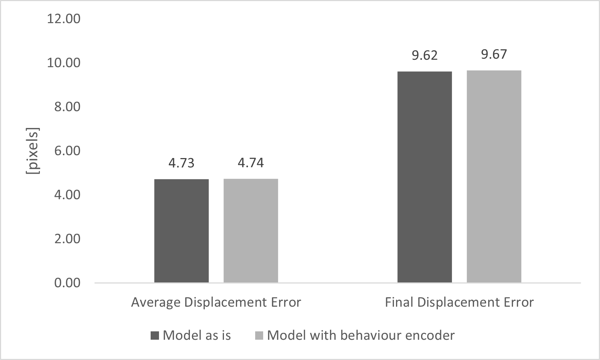

# Pedestrian bounding box prediction library: <br/>
## Introduction:
This is the unofficial code for the papers ["Pedestrian Intention Prediction: A Multi-task Perspective"](https://arxiv.org/abs/2010.10270), accepted and published in [hEART 2020](http://www.heart-web.org/) (the 9th Symposium of the European Association for Research in Transportation) and ["Pedestrian 3D Bounding Box Prediction"](https://arxiv.org/abs/2010.10270), accepted and published in [hEART 2022](http://www.heart-web.org/) (the 10th Symposium of the European Association for Research in Transportation). An implementation of the PIE dataset was added in order to improve the model. The changes that have been made to the model architecture, can pose a problem if you want to run the original code (go to the official git repository : https://github.com/vita-epfl/bounding-box-prediction).

### _Absracts_:
> __Pedestrian Intention Prediction: A Multi-task Perspective__<br /> 
> In order to be globally deployed, autonomous cars must guarantee the safety of pedestrians. This is the reason why forecasting pedestrians' intentions sufficiently in advance is one of the most critical and challenging tasks for autonomous vehicles.
> This work tries to solve this problem by jointly predicting the intention and visual states of pedestrians.
> In terms of visual states, whereas previous work focused on x-y coordinates, we will also predict the size and indeed the whole bounding box of the pedestrian.
> The method is a recurrent neural network in a multi-task learning approach. It has one head that predicts the intention of the pedestrian for each one of its future position and another one predicting the visual states of the pedestrian.
> Experiments on the JAAD dataset show the superiority of the performance of our method compared to previous works for intention prediction.
> Also, although its simple architecture (more than 2 times faster), the performance of the bounding box prediction is comparable to the ones yielded by much more complex architectures.

> __Pedestrian 3d Bounding Box Prediction__<br /> 
> Safety is still the main issue of autonomous driving, and in order to be globally deployed, they need to predict pedestrians’ motions sufficiently in advance. 
> While there is a lot of research on coarse-grained (human center prediction) and fine-grained predictions (human body keypoints prediction), we focus on 3D bounding boxes, which are reasonable estimates of humans without modeling complex motion details for autonomous vehicles. 
> This gives the flexibility to predict in longer horizons in real-world settings. We suggest this new problem and present a simple yet effective model for pedestrians’ 3D bounding box prediction. 
> This method follows an encoder-decoder architecture based on recurrent neural networks, and our experiments show its effectiveness in both the synthetic (JTA) and real-world (NuScenes) datasets. 
> The learned representation has useful information to enhance the performance of other tasks, such as action anticipation.

## Repository structure
------------
    |─── datasets                            : Scripts for loading different datasets
            |─── jaad.py
            |─── jta.py
            |─── nuscenes.py
    |─── preprocess                          : Scripts for preprocessing
            |─── jadd_data.py
            |─── jaad_preprocessor.py
            |─── jta_preprocessor.py
            |─── nu_preprocessor.py
            |─── nu_split.py 
            |─── pie_data.py 
            |─── pie_preprocessor.py     
    |─── visualization                       : Scripts for visualizing the results  
            |─── bbox_from_csv.py   
            |─── video_to_frames.py 
            |─── visualize.py                     
    ├── train.py                : Script for training PV-LSTM  
    ├── test.py                 : Script for testing PV-LSTM  
    ├── networks.py             : Script containing the implementation of the network
    ├── utils.py                : Script containing necessary math and transformation functions
    |── dataset_tester.py       : Script to test the distribution in the datasets

## Installation
------------
Start by cloning this repositiory:
```
git clone https://github.com/vita-epfl/bounding-box-prediction.git
cd bounding-box-prediction
```
Create a new conda environment (Python 3.7):
```
conda create -n pv-lstm python=3.7
conda activate pv-lstm
```
And install the dependencies:
```
pip install -r requirements.txt
```

## Datasets
------------
Currently supporting the following datasets:
* __2D__: [PIE](https://data.nvision2.eecs.yorku.ca/PIE_dataset/)

The network _only_ takes bounding box annotations, thus videos and images are only needed for visualization. 

### PIE
  Clone repo and copy over preprocessing file
  ```
  git clone https://github.com/aras62/PIE
  ```
  Run the preprocessor script
  ``` 
  python3 preprocess/pie_preprocessor.py --data_dir=/path/to/PIE
  ```
  For visualization, download the [PIE clips](http://data.nvision2.eecs.yorku.ca/PIE_dataset/) (UNRESIZED) and unzip them in the `vizualization` folder. Then, run the script `bbox_from_csv.py` to convert the result of the prediction into a csv. After that run the script `video_to_frames` to convert the PIE videos into frames, print the bounding boxes on it and reassemble the annotated frames to produce a gif.

### Training
Run the training script
  ```
  python3 train.py --data_dir=/path/to/PIE/processed_annotations --dataset=pie --out_dir=/path/to/output --n_epochs=100 --task='2D_bounding_box-intention' --input=16 --output=16 --stride=16
  ```

### Testing
Run the testing script
  ```
  python3 test.py --data_dir=/path/to/PIE/processed_annotations --dataset=pie --out_dir=/path/to/output --task='2D_bounding_box-intention'
  ```

## Findings

### Crossing distribution
train | test | val


The crossing distribution is not the same as the one in the paper. This is due to the fact that the dataset was updated and the annotations were changed. The new annotations are more precise and the crossing distribution is more realistic.


### Training on PIE and testing on JAAD


The results were compared with the ones in the original paper. The results are similar but in general, if we train our model on PIE and test it on JAAD, the results are worse for the bounding box prediction but better for the intention accuracy.

### New model - Backbone extension

Four additional features were added to the backbone of the model: Action, Gesture, Look and Number of Lanes. To achieve this, another LSTM encodeer was added and the hidden states were fed to the existing concatenation layer. The results are shown below.



The results show no significant improvement. The reason for this could be that the features are not very informative. The action, gesture and look features are not very precise since they are only binary variables. The number of lanes is the only one that could be useful but it is not very informative either.

## Tested Environments
------------
  * Ubuntu 18.04, CUDA 10.1
  * Windows 10, CUDA 10.1


### Citations

```
@inproceedings{bouhsain2020pedestrian,
title={Pedestrian Intention Prediction: A Multi-task Perspective},
 author={Bouhsain, Smail and Saadatnejad, Saeed and Alahi, Alexandre},
  booktitle = {European Association for Research in Transportation  (hEART)},
  year={2020},
}
```

```
@inproceedings{saadatnejad2022pedestrian,
title={Pedestrian 3D Bounding Box Prediction},
 author={Saadatnejad, Saeed and Ju, Yi Zhou and Alahi, Alexandre},
  booktitle = {European Association for Research in Transportation  (hEART)},
  year={2022},
}
```
